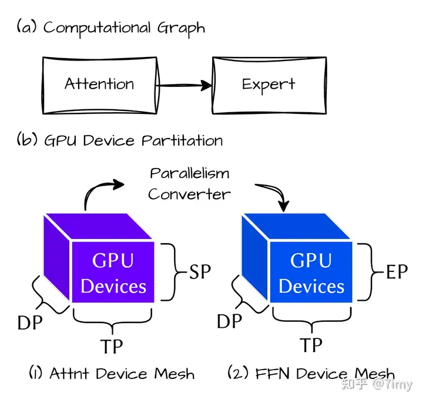
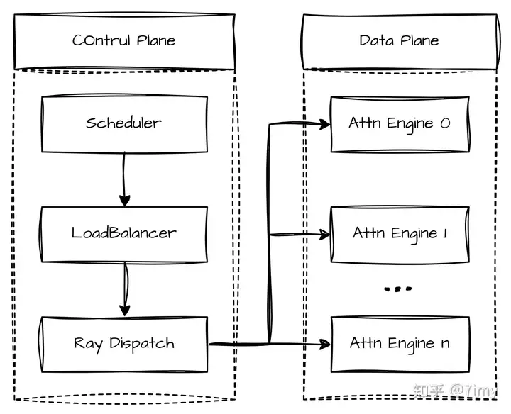

## NanoDeploy - Engine

### 1. 背景分析

近年来，大语言模型（LLM）的参数规模快速增长，以应对日益复杂的任务需求。如何在大幅扩充模型容量的同时控制算力成本，成为了行业面临的核心挑战。为此，混合专家（MoE）架构逐渐成为顶尖模型（SOTA）的标配。
MoE 模型的内部由多个专门的“专家”网络和一个“路由调度员”（Router）组成。当 Token 输入时，Router 会将其精准分配给最匹配的少数专家进行处理。通过这种机制，模型在保持庞大总参数量的同时，能将每个 Token 的实际计算开销控制在合理范围内，实现“大而不笨”。
在现代大模型推理系统中，Prefill（预填充）和 Decode（解码）分离已成为标配。但无论是处理长上下文的 Prefill，还是自回归的 Decode，只要涉及 MoE 专家权重的加载，系统都会面临极高的显存带宽压力。为了摊薄这部分开销，系统通常需要尽可能增大 Batch Size。然而，这打破了传统 Dense 模型中互不干扰的数据并行（DP）状态。为了在保证低延迟的同时最大化吞吐量，主流框架纷纷转向了数据并行 + 专家并行（DP-EP）的混合架构。
在这种混合架构下，系统的执行逻辑被分为截然不同的两部分：

- 非专家层（如 Attention）： 继续沿用纯 DP 模式。每张卡拥有完整的参数副本，独立处理请求，吞吐量可随机器数量线性增长。
- 专家层（MoE）： 受限于单卡显存，EP 机制将不同的专家分布到不同的 GPU 上。这意味着在执行 MoE 层时，Token 需要被派发（Dispatch）给远端的对口专家，计算完成后再将结果取回（Combine）。

### 2. 挑战分析

这种数据的分发与接回，直接引入了两次重量级的全局（All-to-All）通信。这是 MoE 引擎架构设计的核心痛点，从底层开发的视角来看，它带来了三个维度的重大转变：
2.1 调度视角：从“局部自洽”到“全局协同”

- Dense 模型（纯 DP）： 引擎的调度是高度本地化和解耦的。节点的 Scheduler 仅需关注本地显存和 Request 队列，节点间互不干扰，系统容错率极高。
- EP MoE 模型： 由于动态路由和 All-to-All 通信的存在，孤立的节点必须化身为高度协同的分布式系统。进入 MoE 层时，Lock-step（锁步）机制要求严格的统一调度，节点必须按部就班地等待数据交换。这迫使引擎必须引入全局调度器（Global Scheduler），甚至微批次（Micro-batching）机制来有组织地错开通信与计算。
  2.2 性能瓶颈：从“计算密集”到“木桶效应”
- Dense 模型： 优化的核心目标是拉高计算密度（Arithmetic Intensity），通过 FlashAttention 或算子融合等手段最大化利用 Tensor Core 的算力。
- EP MoE 模型： 优化的核心变成了对抗“木桶效应”。由于同步屏障（Barrier）的存在，集群的最终性能往往受限于因负载倾斜或网络抖动而变慢的“长尾节点”（Straggler），大量时间被消耗在等待同步上。

### 3. NanoDeploy-Engine

NanoDeploy 从设计之初就坚持精简的底层架构，高度聚焦于最核心的混合并行与调度机制。这种高内聚的模块化结构，不仅降低了源码阅读和二次开发的门槛，也让触达底层的极致性能调优变得更为直接。
基于这种极简架构，NanoDeploy 在两大核心场景中展现了独特的优势：

#### 3.1 像单机一样丝滑的离线 WideEP 体验

传统的推理生态往往将在线服务（Online Serving）和离线跑批（Offline Batch Inference）割裂为两套系统。NanoDeploy 打破了这一壁垒，将“在离线同时支持”作为一个统一的子项目进行构建。 过去，在多机集群上部署千亿级 MoE 模型并执行离线大 Batch 任务，配置跨机专家并行（WideEP）极其繁琐——涉及复杂的分布式脚本、RDMA 网络调优以及节点间的拓扑对齐。NanoDeploy 彻底颠覆了这一点。 得益于高度抽象的底层设计，用户在离线跑批时，可以“像单机一样丝滑地使用 WideEP 模式”。只需给定模型和节点列表，引擎即可自动接管并编排跨节点的专家路由与权重拉取。这种“开箱即用”的体验极大地抹平了多机通信的门槛，让算法工程师能将 100% 的精力投入到任务产出中。

#### 3.2 彻底解耦的混合并行

NanoDeploy 在底层将 Attention 与 FFN 的并行策略完全解耦（如图 1 所示）：

- 双 Device Mesh 抽象： 在物理集群之上构建两套独立的逻辑设备网格。一套专用于管理 Attention 的 DP/TP 拓扑，另一套专用于管理 MoE 的 EP 拓扑。
- 无缝的并行域转换 (Parallelism Transition)： 当 Token 完成 Attention 计算进入专家层时，引擎会自动通过底层的高效通信算子（如基于 DeepEP 的 All-to-All），在两个 Device Mesh 间进行数据流重组与切换。确保了 Attention 层享受纯 DP 的极简调度，而 FFN 层能瞬间切换到 EP 模式。

#### 3.3 全局调度器 (Global Scheduler)

在传统的 Dense 模型中，数据并行（DP）节点之间相互独立，各自维护本地的调度队列。这种“各扫门前雪”的单机局部调度在纯 DP 模式下极其高效。
但在 DP+EP 的混合并行架构下，MoE 的跨机路由彻底打破了这种独立性。由于 EP 机制强制要求所有参与计算的节点在进入专家层时必须进行锁步的数据交换，这就引发了一个致命的连锁反应：锁步机制直接引爆了严重的 DP 负载不均衡（DP Imbalance）。
试想一下：当多个独立的 DP Worker 为了追求本地吞吐而盲目拉满 Batch 时，海量 Token 进入 MoE 层触发动态路由，往往会呈现出极强的分布倾斜——大量 Token 瞬间集中涌向某台机器上的“热门专家”。由于必须“齐步走”，那些处理冷门专家、早早计算完毕的 DP 节点只能在同步屏障（Barrier）前无奈干等，整个集群的推进速度被那台最慢的过载节点死死拖住。原本为了提升吞吐的局部最优调度，在“齐步走”的强制规则下，反而成了放大局部倾斜、导致全局算力大规模闲置的元凶。

既然 EP 的“齐步走”已经将整个集群的计算步调强行绑定，NanoDeploy 决定彻底抛弃单机调度的幻想。我们将控制平面从数据平面剥离，引入了一个拥有“上帝视角”的全局调度器（Global Scheduler，图 2）：
\- 集中化管控，告别盲目发车： 在发起 Forward Pass 前，全局调度器通过极低延迟的控制面通道（Control Plane）实时收集所有节点的负载与水位状态。调度器向各个节点精准下发统一的执行指令。这就从根本上消灭了无序通信带来的拥塞风险，将 Lock-step 同步等待转化为有序的数据交换。
\- 共享全局队列与负载均衡： 全局调度器接管了所有 DP 实例的生命周期，Request 统一驻留在共享全局队列（Global Queue）中。结合暴露的全局负载均衡接口（Load Balancing API），调度器能够根据集群拥塞情况、Sequence 长度分布以及专家的排队热度，智能挑选最优节点进行调度，从源头上规避单点过载。

## 4. 总结 (Summary)

NanoDeploy 从零构建了一套面向 MoE 大模型的精简推理引擎，以极低的代码复杂度实现了生产级的混合并行能力。其核心贡献可归结为三点：

**架构层面**：通过双 Device Mesh 抽象，将 Attention（DP/TP）和 FFN（EP）的并行策略彻底解耦。数据在两个并行域之间的切换由引擎自动完成，上层开发者无需感知跨域通信细节。

**调度层面**：引入全局调度器，从根本上解决了 EP 锁步机制导致的 DP 负载倾斜问题。通过集中化的请求分发和实时的负载感知，将分布式集群的"齐步走"从性能陷阱转化为有序协同。

**体验层面**：统一了在线服务和离线跑批的部署路径，让多机 WideEP 的使用体验与单机推理一样简洁——给定模型和节点列表即可开箱运行。

在此基础上，NanoDeploy 进一步集成了 MTP 投机解码（详见 [NanoDeploy - MTP 投机解码](nanodeploy-mtp.md)），通过 Lazy Verify 策略在不增加显著工程复杂度的前提下，利用模型自带的 MTP head 实现了每步多 token 产出，进一步压缩了 decode 延迟。精简的内核架构使得这类前沿优化能够快速落地并保持代码的高可维护性。
