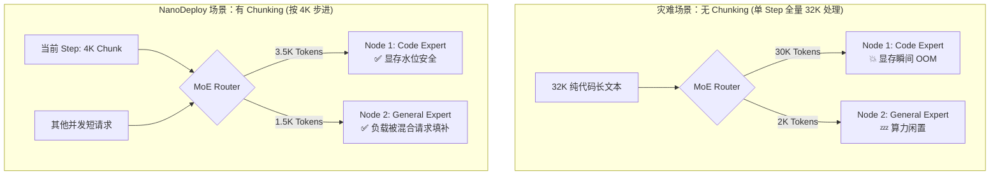
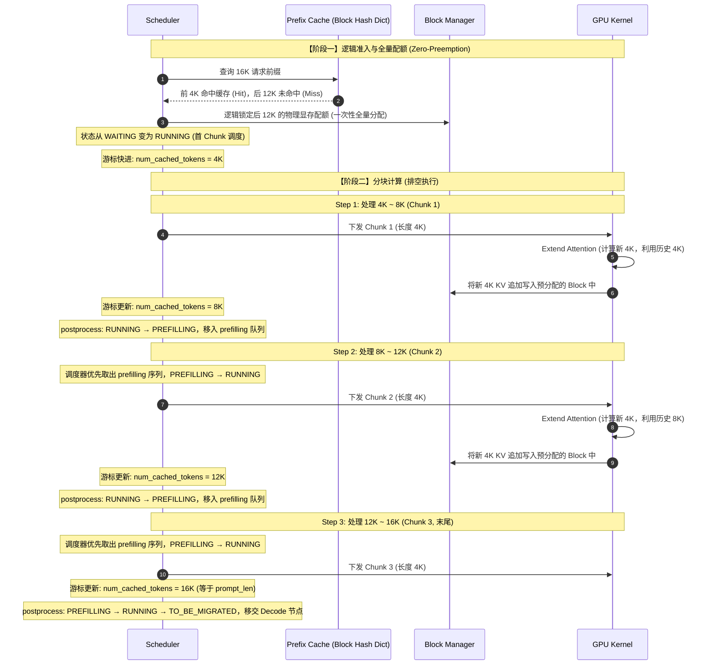

# Chunked Prefill 与 Prefix Caching 架构设计文档

## 1. 背景与动机

在早期的 LLM 推理系统设计中，Chunked Prefill 主要用于解决长文本 Prefill（预填充）对 Decode（解码）阶段的长时间抢占问题，防止生成卡顿（TTFT 与 TPOT 的权衡）。

考虑到当前 NanoDeploy 系统已全面拥抱 **PD 分离（Prefill-Decode Disaggregation）** 架构，单节点内 Prefill 对 Decode 的抢占效应已基本消除。然而，Chunked Prefill 的功能依然不可或缺，它现在主要服务于系统底层的 **DP + EP（数据并行 + 专家并行）** 混合并行策略：

1. **平滑 DP 负载**：若 DP 实例接收的 Prefill 长度落差过大（例如 32K vs 2K），会导致节点间计算负载严重失衡。
2. **平滑 EP 负载与控制显存峰值**：超长文本中特定领域的 Token 聚集极易导致单个 Expert 过载（拥塞）。Chunked Prefill 能够将超长文本在时间维度上打散，与其他短请求混合组 Batch，既降低了单 Step 的运行时显存水位，又大幅提升了 EP 的负载均衡与系统稳定性。

综上，本模块专为 **PD 分离模式** 量身定制。调度核心采用 **Drain-Prefill（排空预填充）** 原则，彻底摒弃了主流框架（如 vLLM, SGLang）为支持 Continuous Batching（混跑）而引入的复杂抢占、回滚及动态页块伸缩逻辑，实现了极简且极度稳健的状态机。

### 💡 深度解析：为什么 Chunked Prefill 是平滑 EP 显存峰值的关键？

在传统的认知中，Chunked Prefill 主要用于优化 TTFT（首字延迟）。但在 NanoDeploy 的 PD 分离架构下，它承担了更核心的任务：**解决 MoE 专家并行（EP）下的“领域 Token 聚集导致的显存击穿”问题。**

在处理超长文本时，文本的上下文通常具有高度的领域一致性（例如一篇 32K 的纯代码文档）。如果不进行 Chunk 切分，MoE Router 极易将海量 Token 集中派发给单一的物理 Expert 节点，导致该节点的 Activation Memory（激活显存）瞬间 OOM，而其他节点严重闲置。

Chunked Prefill 本质上是在**时间维度**上将庞大的连续特征打散，强行压平单 Step 的显存峰值：



______________________________________________________________________

## 2. 核心设计思路：Drain-Prefill 与 极简状态机

### 2.1 Drain-Prefill 调度原则与唯一 Chunk 约束

NanoDeploy 采用 Drain Prefill 调度方式，严格遵从如下防重入原则：

1. 单个 DP 实例的调度批次（Batch）内允许存在多个完整的短 Prefill 请求，但**最多仅存在一个正在被切分的 Chunk 请求**。
2. 若某 Chunk 请求已开始切分执行，调度器必须优先完成该请求的所有后续 Chunk 计算，期间拒绝切分新的超长请求（但允许混入其他短请求进行 Batch Padding）。

> **实现说明**：唯一 Chunk 约束是由 `max_num_batched_tokens` budget 自然保障的**软约束**——一个 chunked 序列通常占满大部分 budget，同一 DP 上第二个 chunked 序列难以获得额度。代码中无硬性计数器检查。不同 DP 实例可各自拥有独立的 chunked 序列。

### 2.2 显存管理机制 (全量逻辑分配)

为从根本上消灭计算中途的 OOM（显存溢出）风险，系统在内存准入期采用极其保守、安全的分配策略：

- `can_allocate` 和 `allocate` 操作对**令牌配额** (`sp_state.num_dispatched_token`) 和**物理页表** (`sp_state.block_table`) 均执行**一次性全量分配**。
- 即：一旦系统准入了一个 32K 的超长请求，其完整的物理显存空间即被安全锁定。后续的 Chunk 切分仅属于纯粹的计算拆分，绝不会因显存不足引发崩溃。

### 2.3 驱逐策略 (Eviction)

沿用现有设计：在 Step 0 准入时，评估可用显存是否能容纳完整序列。若不足，则触发 LRU 缓存驱逐；若驱逐后依然不足，请求则留在 Waiting 队列。
**核心原则：运行期（Chunk 步进计算时）绝对不触发任何驱逐操作。**

### 2.4 调度器 Token Budget 与进度追踪

- **调度器 Budget**：新增 Token Budget 模块，记录当前已进入调度器的待执行 Token 总量，以此严格控制单 Step 的最大计算量（`max_num_batched_tokens`）。
- **进度追踪 (`num_cached_tokens`)**：新增 ChunkPrefill-Context 管理，精确记录当前 Sequence 已计算并写入 KV Cache 的 Token 数量。该变量作为系统判断执行阶段的唯一依据：
  - `num_cached_tokens < prompt_len`：处于 Prefilling 阶段。
  - `num_cached_tokens == prompt_len`：Prefill 完毕，准备进入 Decode 或 RDMA 状态转移。
- **缓存系统兼容**：缓存系统和 Chunk-Prefill 复用 `num_cached_tokens`，系统优先匹配缓存的部分，剩余的部分再进一步切分 chunk。

### 2.5 极简状态机转移 (Zero-Preemption)

由于系统在准入时提前锁定了全量物理显存，本模块（仅限 Prefill 阶段）实现了 **Zero-Preemption（零抢占）**——已准入的序列无需驱逐，确保一路执行到底。

**状态机转移流程**：

```
WAITING ──(准入/首 Chunk 调度)──► RUNNING ──(非末尾 Chunk postprocess)──► PREFILLING
                                     ▲                                        │
                                     └───────(下一 Chunk 调度)────────────────┘
                                     │
                                (末尾 Chunk postprocess)
                                     │
                                     ▼
                            FINISHED / TO_BE_MIGRATED
```

- **`WAITING` → `RUNNING`**：序列从 `waiting` 队列被准入，首 Chunk 调度时设为 `RUNNING`，放入 `running` 队列。
- **`RUNNING` → `PREFILLING`**：非末尾 Chunk 执行完毕后，`postprocess` 将状态设为 `PREFILLING`，序列从 `running` 移入 `prefilling` 队列。
- **`PREFILLING` → `RUNNING`**：调度器下一轮优先从 `prefilling` 队列取出序列，调度下一个 Chunk，序列重新放入 `running` 队列。
- **末尾 Chunk 完成**：`postprocess` 检测到 `num_tokens == prompt_len`，将 `PREFILLING` 状态恢复为 `RUNNING`，随后正常处理采样 token，最终状态变为 `FINISHED`（结束）或 `TO_BE_MIGRATED`（PD 分离模式下移交 Decode 节点）。

**核心保障**：调度器始终最高优先级调度 `prefilling` 队列中的序列，无视外部新请求干扰，确保 Drain-Prefill 语义。

- *(注：在 PD 分离架构下，**复杂的 `PREEMPTED` / `SWAPPED` 抢占与换出机制被严格下放保留给后端的 Decode 引擎**。在本模块负责的 Prefill 阶段，已将其彻底移除。)*
- *(Future work: 若 Prefill 期间遇硬件级崩溃，系统将直接触发 Abort，并利用 `num_cached_tokens` 进度条进行粗粒度的任务级恢复。)*

______________________________________________________________________

## 3. Chunked Prefill 运行时与算子支持

### 3.1 MetaData 更新与序列化优化

1. 在原有 `SerializationPrefill` 结构中新增 **`num_cached_tokens`** 变量。
2. 运行时数据下发（Dispatch）时，`tokens` 仅传输**当前 Chunk 真正需要计算**的数量（$L\_{chunk}$），摒弃全量 Prompt 传输，大幅降低 RPC/RDMA 通信开销。

### 3.2 Chunked Attention 实现 (Gather + Causal Varlen)

Chunked Prefill 每次仅计算序列分片（$L\_{chunk}$ 个 Q tokens），但需对完整的历史 KV Context 执行 Attention。当前实现采用 **Gather + Single-Kernel Causal Varlen** 方案：

**1. Q-KV 不对称 (Asymmetry)**

- **Query (Q)**：仅包含当前 Chunk 的 $L\_{chunk}$ 个 tokens，显存内连续存储。
- **Key/Value (KV)**：总长度为 `num_tokens`（= `num_cached_tokens` + $L\_{chunk}$），包含已缓存的历史 KV 和当前 Chunk 新算出的 KV。

**2. Gather + Causal Varlen**

1. **Gather 阶段**：从 Paged KV Cache 中仅收集**已缓存部分**（`num_cached_tokens` 个 K/V）到连续显存，与当前 Chunk 新产生的 K/V 拼接，得到完整的连续 ragged tensor。
2. **Attention 阶段**：调用单次 `flash_attn_varlen_func(Q, K_all, V_all, cu_seqlens_q, cu_seqlens_k, causal=True)`。

**数学等价性**：Causal mask 在完整序列上的行为天然等价于概念上的 "Hybrid Attention"（Context + Self 两阶段）。因为历史 KV 的位置 \< 当前 Chunk Q 的位置，causal mask 不会屏蔽任何历史 token；而 Chunk 内部的 Q-K 对则正常施加 causal 约束。

**3. KV Cache 写入 (In-place Append)**

每次 Kernel 执行完毕后，将当前新算出的 $L\_{chunk}$ 个 KV 数据根据 `slot_mapping`（基于 `num_cached_tokens` 偏移量计算）写入对应的预分配 Block，随后 `postprocess` 更新游标 `num_cached_tokens += L_{chunk}`。

**4. 针对不同 Attention 架构的优化**

- **GQA（Grouped Query Attention）**：Gather 时仅收集已缓存的 K 和 V heads，与 fresh K/V 按序列维度交错拼接（`_gather_kv_cached_concat`）。
- **MLA（Multi-head Latent Attention）**：Gather 已缓存的压缩 KV（compressed_kv），在 Gather 后展开为完整的 K/V heads，再与 fresh expanded K/V 交错拼接。

### 3.3 Future Work: Paged Prefill Attention

当前 Gather 方案需要显式拷贝已缓存的 KV 到连续显存。对于极长前缀（100K+），Gather 的显存带宽和临时缓冲区开销可能成为瓶颈。

主流推理引擎（SGLang、vLLM）已切换到 **FlashInfer** 的 `BatchPrefillWithPagedKVCache` 作为默认后端，该 kernel 在注意力计算内部直接从 Paged KV Cache 随机读取，无需显式 Gather，也无需 Two-pass Merge。未来可集成 FlashInfer 作为可选 Attention Backend，彻底消除 Gather 开销。

______________________________________________________________________

## 4. 架构 Case Study：状态时序流转

以下时序图展示了一个 16K 超长请求在最大 Token Budget = 4K 的系统中的完整执行流转（结合 Prefix Caching 命中情况）：


