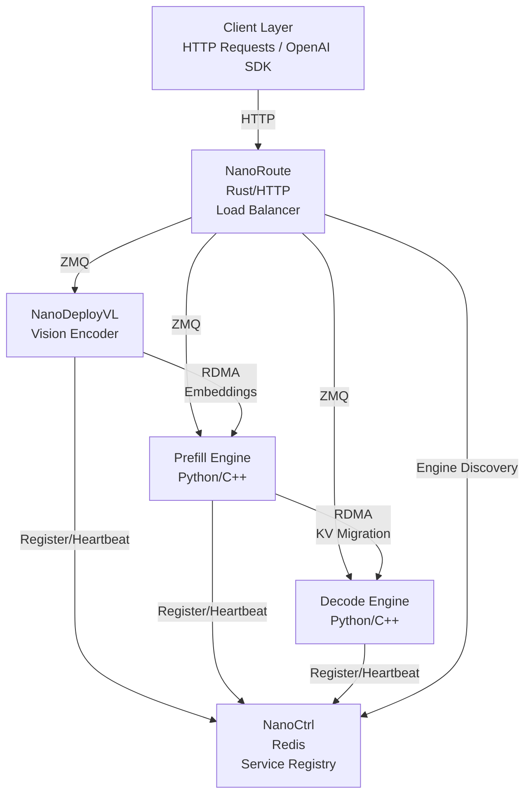

# NanoDeploy: LLM Inference with Prefill-Decode Disaggregation and Wide Expert Parallelism

## 📦 Components

| Component                      | Language    | Description             | Key Features                                                                                    |
| ------------------------------ | ----------- | ----------------------- | ----------------------------------------------------------------------------------------------- |
| [NanoCtrl](./NanoCtrl)         | Rust        | Control plane           | Redis-backed service registry, health monitoring, engine discovery, Python client               |
| [NanoDeploy](./NanoDeploy)     | Python/C++  | LLM inference engine    | Prefill/decode engines, KV cache management, continuous batching, Ray-based distributed workers |
| [NanoDeployVL](./NanoDeployVL) | Python      | Vision-Language encoder | EP-separated ViT encoder, RDMA embedding transfer, Qwen3-VL support                             |
| [NanoRoute](./NanoRoute)       | Rust        | HTTP load balancer      | OpenAI-compatible API, tool calls, routing strategies, engine discovery                         |
| [NanoSequence](./NanoSequence) | FlatBuffers | Protocol definitions    | Wire-format schemas for sequence, packet, and batch interfaces                                  |

## 🏗️ Architecture



## 🚀 Installation

The root `pyproject.toml` acts as a meta-package that lets you install any combination of Python components in a single command.

### One-liner: install everything

```bash
pip install ".[all]"
```

### Install individual components

```bash
pip install ".[dlslime]"      # DLSlime transfer engine only
pip install ".[nanoctrl]"     # NanoCtrl lifecycle client only
pip install ".[nanodeploy]"   # NanoDeploy inference engine only
pip install ".[nanodeployvl]" # NanoDeployVL vision-language encoder only
```

### For developers

```bash
# Build NanoDeploy C++ extensions in-place
cd NanoDeploy && pip install -e . && cd ..

# Build NanoRoute (Rust)
cd NanoRoute && cargo build --release && cd ..

# Build NanoCtrl (Rust) + install Python client
cd NanoCtrl && cargo build --release && pip install -e . && cd ..
```

## Quick Start: PD Disaggregated Serving

Prefill-Decode disaggregation splits prompt processing (prefill) and token generation (decode) across separate GPU nodes connected via RDMA.

### Prerequisites

- 2 nodes with NVIDIA GPUs (SM90+ for FP8), RDMA-capable NICs
- Redis, Ray cluster, Rust toolchain

#### 1. Start Ray

```bash
# Node 0 (head)
ray start --head --port=7078 --dashboard-host=0.0.0.0

# Node 1 (multi-node only)
ray start --address <node0-ip>:7078
```

### Offline mode

Batch generation without HTTP serving.

#### Single node (no NanoCtrl needed)

```bash
python NanoDeploy/examples/non_disagg.py \
    --model /models/Qwen3-235B-A22B \
    --ray_address <node0-ip>:7078 \
    --master_address <node0-ip>:6006 \
    --attention_dp 8 --ffn_ep 8 \
    --kvcache_block_size 256 \
    --prompt "1+1=?" --max_tokens 128
```

#### PD disaggregated (2 nodes)

##### 2. Start Redis + NanoCtrl

```bash
redis-server --bind 0.0.0.0 --port 6379
cd NanoCtrl && cargo run --release    # edit config.toml to set redis_url
```

##### 3. Launch engines

```bash
python NanoDeploy/examples/disagg.py \
    --model /models/Qwen3-235B-A22B \
    --ray_address <node0-ip>:7078 \
    --nanoctrl_address <node0-ip>:3000 \
    --attention_dp 8 --ffn_ep 8 \
    --prefill.master_address <node0-ip>:6006 \
    --decode.master_address <node1-ip>:6006
```

### Online mode

ZMQ engine servers with OpenAI-compatible HTTP API via NanoRoute.

##### 2. Start Redis + NanoCtrl

```bash
redis-server --bind 0.0.0.0 --port 6379
cd NanoCtrl && cargo run --release    # edit config.toml to set redis_url
```

##### 3. Start NanoRoute

```bash
cd NanoRoute && cargo run --release    # edit config.toml to set nanoctrl_address
```

##### 4. Launch engines

```bash
# Terminal 1 — Decode engine
python NanoDeploy/nanodeploy/server/engine_server.py \
    --model /models/Qwen3-235B-A22B \
    --mode decode \
    --ray_address <node0-ip>:7078 \
    --nanoctrl_address <node0-ip>:3000 \
    --nanoctrl_scope nanoctrl-0 \
    --master_address <node1-ip>:6006 \
    --host <node0-ip> --port 6001 \
    --attention_dp 8 --ffn_ep 8 \
    --kvcache_block_size 64 \
    --max_num_batched_tokens 16384 --max_model_len 16384

# Terminal 2 — Prefill engine
python NanoDeploy/nanodeploy/server/engine_server.py \
    --model /models/Qwen3-235B-A22B \
    --mode prefill \
    --ray_address <node0-ip>:7078 \
    --nanoctrl_address <node0-ip>:3000 \
    --nanoctrl_scope nanoctrl-0 \
    --master_address <node0-ip>:6006 \
    --host <node0-ip> --port 6002 \
    --attention_dp 8 --ffn_ep 8 \
    --kvcache_block_size 64 \
    --max_num_batched_tokens 16384 --max_model_len 16384
```

##### 5. Send requests

```bash
curl http://<node0-ip>:8080/v1/chat/completions \
  -H "Content-Type: application/json" \
  -d '{"model": "/models/Qwen3-235B-A22B", "messages": [{"role": "user", "content": "Hello"}]}'
```

______________________________________________________________________

## 📄 License

See individual component [license](./LICENSE).

## 📞 Support

- **Issues**: [GitHub Issues](https://github.com/JimyMa/NanoDeploy/issues)
- **Documentation**: Check component READMEs
